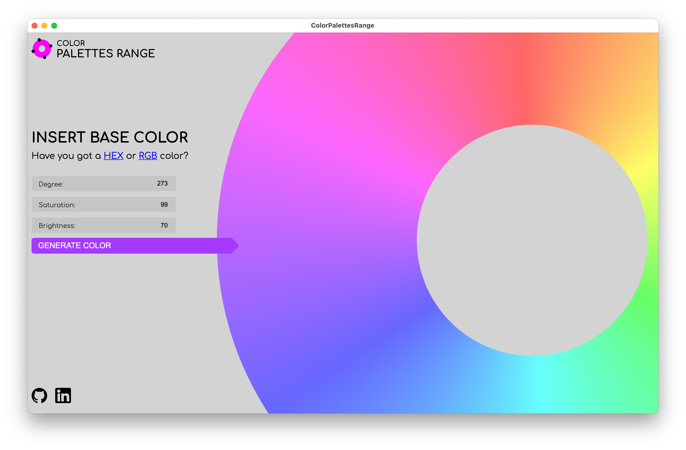
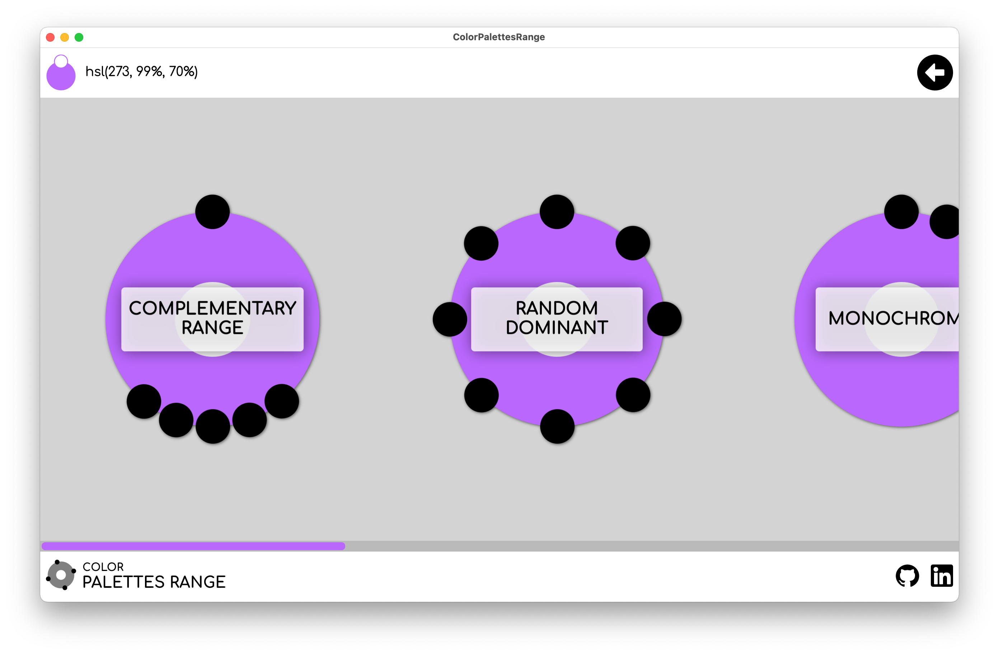
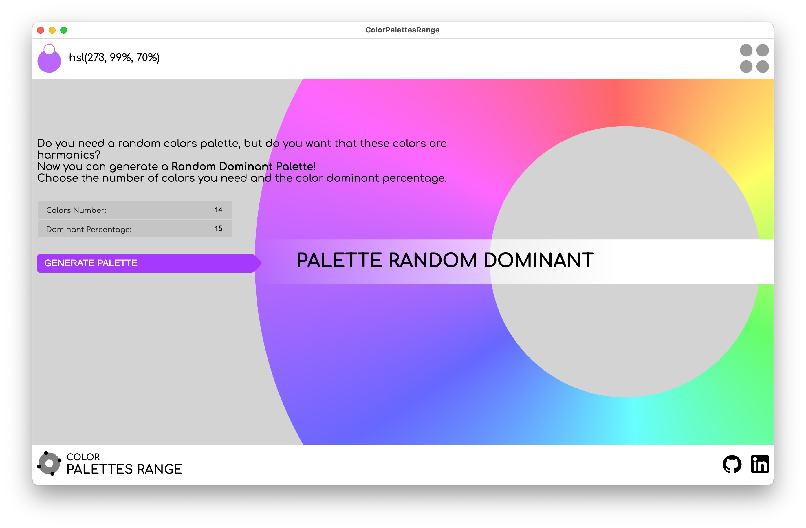
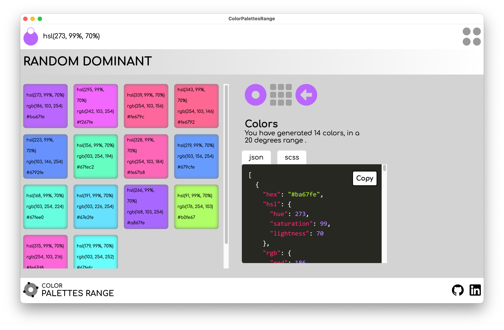
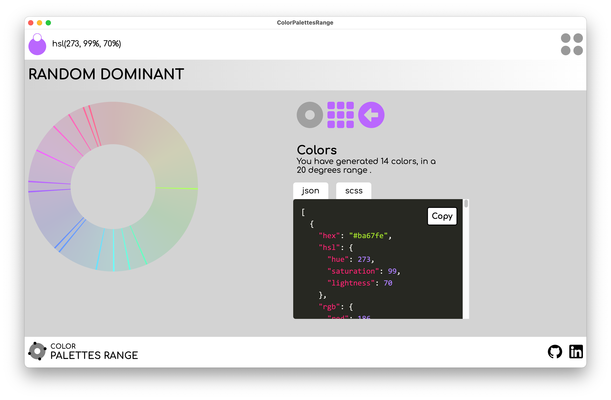

# Are you bored with classic color palettes?
Now you can generate more than three or five colors palette:
take a Complementary Palette or a Random Dominant Palette, and you can decide how many colors you want!

You can copy a single color in HSL, RGB, HEX format, or your single palette in JSON or SCSS formats.

## This App is developed in VueJS/Electron and is based on my npm package Color Palettes Range

## Download Color Palettes Range
[Mac](https://chiarapassaro.dev/colorpalettesrange/make/zip/darwin/x64/ColorPalettesRange-darwin-x64-0.1.0.zip) - [Win](https://chiarapassaro.dev/colorpalettesrange/make/zip/win32/x64/ColorPalettesRange-win32-x64-0.1.0.zip)
*Windows: If exe not run right click and use compatibility test.*

## Screens

